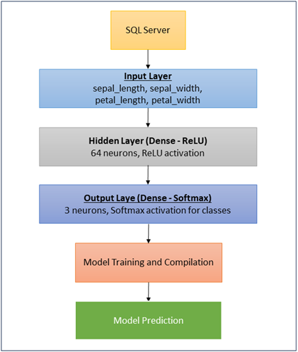

# GnoelixiAI Simple Neural Network

Welcome to the **GnoelixiAI Simple Neural Network** project! This repository provides the code and resources for building a simple neural network using **Keras**, **TensorFlow**, **Python**, and **Microsoft SQL Server**. The project was initially featured in the GnoelixiAI Hub newsletter and is designed to train a model on the Iris dataset stored in SQL Server.

Read the full article on LinkedIn: [Creating a Simple Neural Network with Keras, TensorFlow, Python and SQL Server](https://www.linkedin.com/pulse/creating-simple-neural-network-keras-tensorflow-python-artemiou-uhqnf/)

## Project Overview

This project demonstrates how to:
- Connect Python to SQL Server to fetch data.
- Build, train, and evaluate a neural network using Keras and TensorFlow.
- Use the Iris dataset to classify flower species based on sepal and petal measurements.

## Architecture

The neural network has the following layers:
1. **Input Layer**: Four features from the Iris dataset.
2. **Hidden Layer**: 64 neurons with ReLU activation.
3. **Output Layer**: 3 neurons with Softmax activation for classification.



## Getting Started

To get started, clone this repository and follow the steps below to set up the environment, prepare the SQL Server database, and run the model.

### Prerequisites

1. **Python 3.9+**
2. **SQL Server** with the Iris dataset in a database (instructions below)
3. Required Python libraries:
   - pyodbc
   - pandas
   - keras
   - tensorflow
   - scikit-learn

### Installation

1. **Clone the repository**:
   ```bash
   git clone https://github.com/aartemiou/gnoelixiai-simple-neural-network.git
   cd gnoelixiai-simple-neural-network
   ```

2. **Install Dependencies**:
   ```bash
   pip install pyodbc pandas keras tensorflow scikit-learn
   ```

3. **Setup SQL Server**:
- Create a database named IrisDB.
- Create a table named iris_data with columns for sepal length, sepal width, petal length, petal width, and species.
- Populate the table with the [Iris Dataset](https://archive.ics.uci.edu/dataset/53/iris) (150 records).

### Running the Code
1. Run the neural network training and prediction script:
```bash
python gnoelixiai_simple_neural_network.py
```

2. Output  
The script will train the model, display the model’s predictions, and calculate the accuracy based on the sample prediction data.

## Model Performance

In the sample implementation:

- **Initial model accuracy with 10 epochs:** 66.67%
- **Improved model accuracy with 30 epochs:** 100%

Fine-tuning the training epochs significantly impacted model accuracy, showcasing the importance of hyperparameter tuning.  

## License

This project is licensed under the MIT License - see the [LICENSE](LICENSE) file for details.  

## Additional Resources

- [My YouTube Channel](https://www.youtube.com/@aartemioutech)
- [TensorFlow Documentation](https://www.tensorflow.org/)
- [Keras Documentation](https://keras.io/)
